## Extra Credit Questions:

*I didn't realize these were only on paper until after writing the code for the BST so I'm sorry*
1) 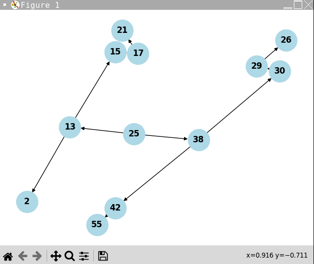

2/3/4. 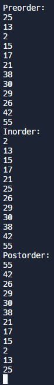

5) 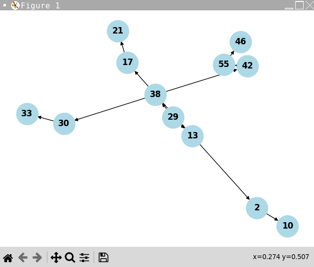

6) 

7) We could save the keys in the way of doing a preorder traversal. This will ensure we start with the root node and then we will build the left subtree and then the right tree in the correct order - more of a top down approach.

8) A BST wouldn't be a good solution if the list is already sorted increasing or decreasing. This is the case because then we would simply go root.right.right... or root.left.left.left... for all the nodes which would simply just be a linked list. An alternative solution would be to have a self balancing tree, heap, type structure where rotations are made to ensure the tree is balanced and we aren't creating a linked list.

9) The same amount of black nodes to each leaf would be violated. This is because 13 has height 2 while 46 has height 5, which would make it impossible to satisfy this property without having consecutive red nodes.

10) 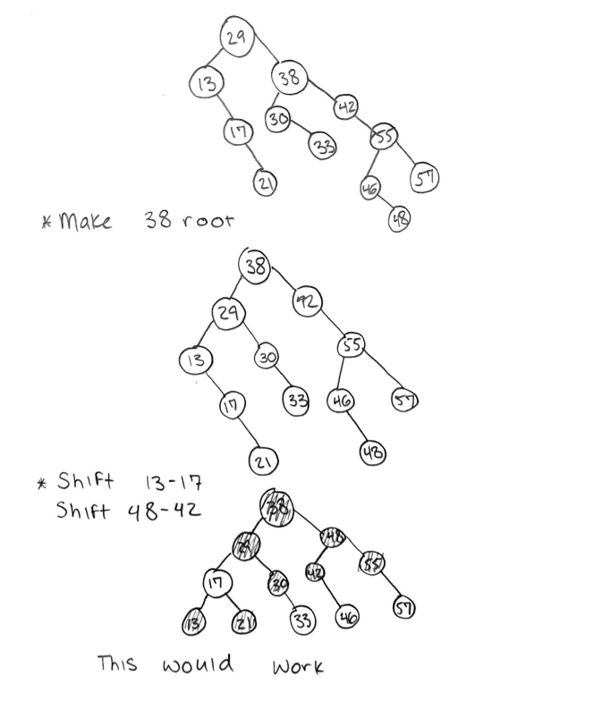

11) A hash table would have a faster search operation has there would be a hash function that maps keys and location, which would often times be a better search time - averaging at O(1) - compared to a balanced tree with O(log n).

12) 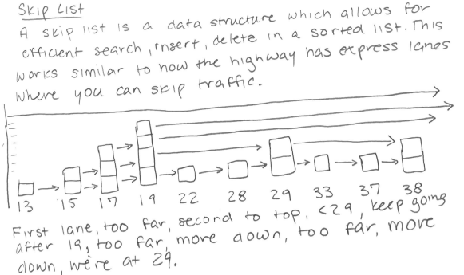

13/14. 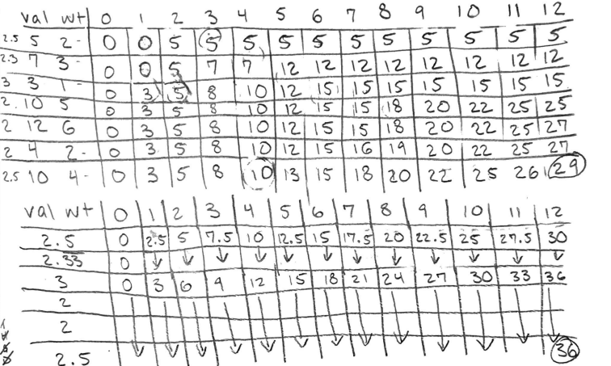

16-18. 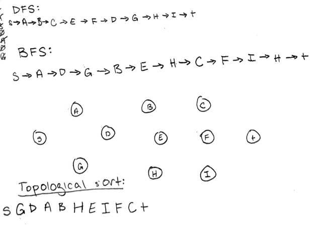

19) 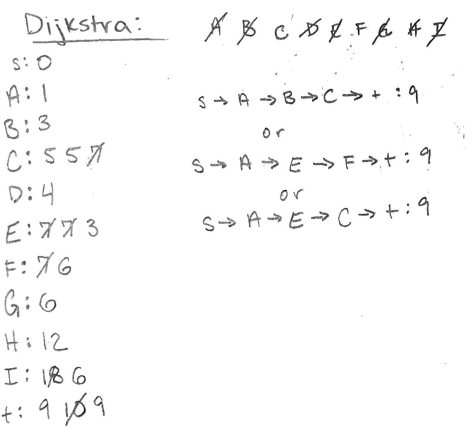

20) 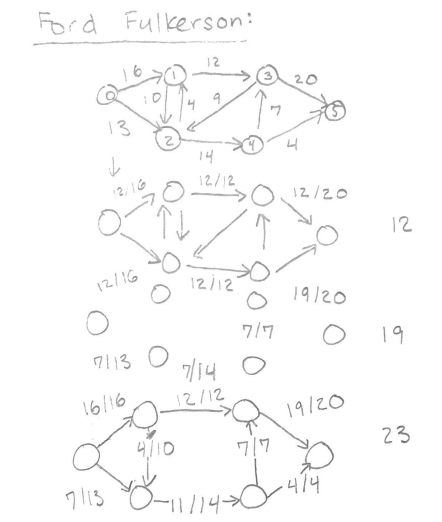

21-24. 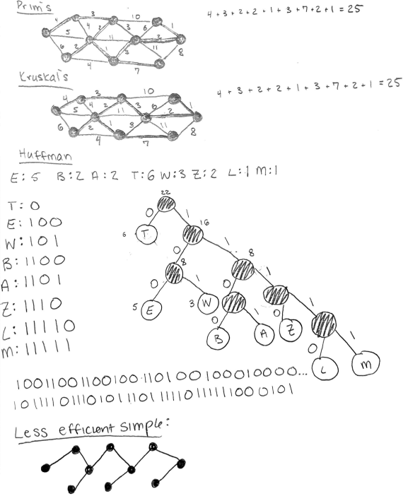

25) 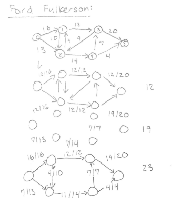

26) P - polynomial time, defined by runtime of best solution- O(n^k)
    NP - nondeterministic polynomial time, many possible solutions but don't know how to deterministically find solution
    NPC - NP completeness, the hardest problems in NP
    NP - Hard, at least as hard as hardest in NP, but don't have to be in NP
    P vs NP - phenomenon when relating polynomial time to problems, whether problems are polynomial time always
    
28) The travelling salesman problem attempts to find the shortest route that vists each city, but visits each city only once while returning to the origin city. The minimum spanning tree on the other hand attempts to connect all the vertices with the minim total cost and isn't concerned with only visiting each vertice once. Because of this MST can be solved using Kruskal or Prim's algorithm in polynomial time, but TSP isn't guaranteed because the time grows with the number of cities(numberOfCities!).