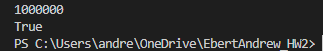

## Q1

* The general idea for this algorithm would be to use a min-heap. Because we don't know if any sublists contain larger elements(meaning list 1 has all 5 elements smaller than the first element of list 2), it's important to note that the min heap would be at most size k; so intially the first element from all sublists would be k, and then once the min value is found and extracted, the next value from the list where the min value was extracted is inserted into the min-heap. There would be n iterations of this, where finding the min element takes O(log k) each time; therefore, we would have O(n * log k) for each iteration taking log k for n iterations. This process would allow for a size no bigger than k in our min heap, systematically approaches inserting based on the element removed to the new list(the next element from the sublist that had the min element could still be smaller than the remaining values in the min-heap), and supports O(n log k).

* It's a game changer having O(nlogk) vs O(nk) and as seen in one of the previous homeworks, one ran in approximately 20 seconds vs 20 hours. So it's important to have sorting algorithms and merging algorithms that are efficient, especially when it comes to sorting 1,000,000 integers.

* 
## Q3

#### b. We could start by doing an inorder traversal of the tree, marking each node with a number(smallest to largest: i.e. smallest key node will be marked 1). We can then sort the list of keys, inserting them into the tree based from smallest to largest.

#### c. We can first assume the fixed shape will be given to us with proper conditions. Next we can insert our values each node at a time. Once all are inserted, we will continue iterating through the tree while we are sorting; thus, we will make sure the values uphold the conditions of a BST while keeping the structure/conditions provided for the tree.

#### d. The specific instance wouldn't allow for a valid red-black tree because the left subtree has max height of 6 while the right subtree has min height of 2, which would make it impossible to satisfy the black node rule.

#### e. The first rotation will be on the node with key 67. We rotate so that 67 has two children, 59 and 70. The second rotation will be replacing 67 with 90 such that each subtree has 3 elements. This will uphold all properties of RB tree.
