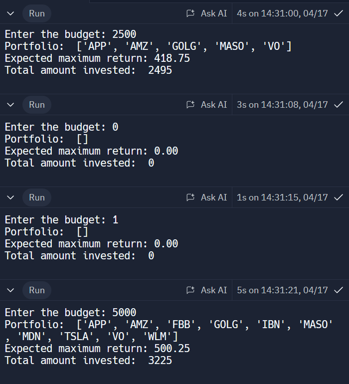
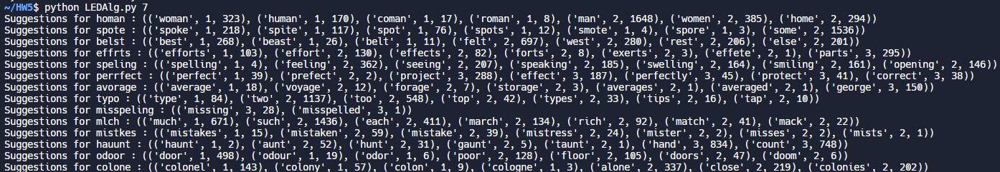

## Q1
a) Imagining this as a tree, where the child nodes must be patched before the parent node, we could first start with a DFS that will give us the lowest level. From here, we can use an algorithm that patches all nodes on this level, then moves up a level and updates all nodes on this level, continuing to do this until the root node of the tree is patched.

b) 
  1) get lowest level
  2) get all nodes on this level
  3) patch all nodes on this level
  4) move up a level until
  5) repeat steps 2-4 until root node is patched

c) A problem with this approach is if the networks were structured as a linked list, as this would be a very inefficient implementation, and for the case it might make sense to treat it as a list where we move from left to right, instead of constantly needing to search nodes on each level. Another problem would be if a parent node also is connected to a node on a lower level(or possibly the same level depending on where in the tree it is). This would create a problem where the lower level node is updated before the parent even though the parent points that node.

d) 
  1) get lowest level
  2) get all nodes on this level
  3) patch all nodes on this level, halt if the node is already patched
  4) move up a level until
  5) repeat steps 2-4 until root node is patched

e) 
  1) get lowest level
  2) get all nodes on this level
  3) ensure all subtrees of node are patched, if not skip
  4) if the threshold is greater for a node, skip and continue with others
  5) patch all nodes on this level, halt if the node is already patched
  6) move up a level until
  7) repeat steps 2-4 until root node is patched

## Q2-1

## Q2-2
All you would need to do is traverse through the return ratios array to find the stock with the highest return ratio, as you can buy partial stocks as well. Therefore, you could find the highest return ratio, and multiply it by the amount you're investing to find out your expected return. You could also do investment price / stock price in order to find how many shares you'll own of the given stock.

## Q4
