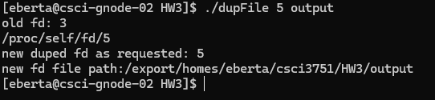
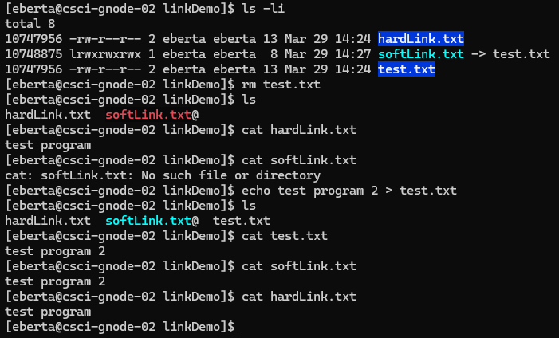
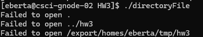

## Question 1

## Question 3
* A hard link is a reference to a file, which has the same inode as the linked file; a soft link is more of a reference, where it's a file simply containing the file name it's linked to. This can be seen from the first command I ran, where the inodes are the same for hardLink and test, but different for softLink; likewise, the size, 13, is the same for both hardLink and test, but is simply 8 for softlink(the length of 'test.txt'). One advantage of a hardLink is the original file can still be accessed if it was deleted, but this can't be done with softLink because the file name no longer exists. This can be seen in the example. An advantage to a softLink is both file size and ability to be changed easily; the file size is only the length of the file it's linked to. Likewise, if the original file is deleted, it can be restored if a file is created with the name that the softLink was originally linked with. In this example, the softLink contains the edited message whereas the hardLink does not.

## Question 4
* Rmdir does succeed, deleting the directory, which causes the program not to access the deleted directory with any of the given specifiers.

## Question 5
* The command fflush(aFilePointer) instructs the C library to flush the buffered data, in file pointed to by aFilePointer, from stdio buffer to the kernel buffer. The command fsync(fileno(aFilePointer)) instructs the operating system to store the kernel buffers associated with the given file. Essentially, the first command ensures the stdio buffer is flushed to kernel buffer, and then the second command actually stores the kernel buffer to the memory.