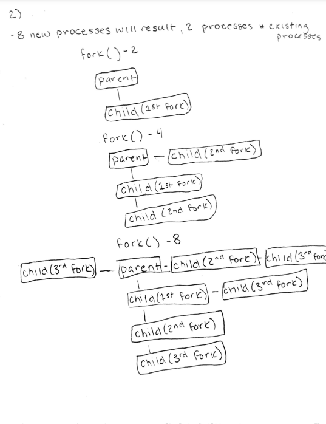

## Question 1

## Question 2
The issue with the code is an automatic variable is returned after executing the function. When the function is terminated, the stack will deallocate the memory where the pointer exists, causing issues. A likely result will be a dangling pointer. A solution to this problem would be to declare these pointers outside of the function so that when the function terminates, the stack where the pointer is will not also be terminated, and will maintain the lifetime of the program.

## Question 3
1) Parent and child processes both return but child returns 0 while parent returns child process id. This is to ensure each child has one parent and can call getppid. Child gets a copy of the parent data space, heap, stack, but this is not shared. Copy on write technique is used when the parent/child have protection as read only, and if changes are made then the kernel makes a copy of the memory. Write is not buffered. Buffers both child and parent creating only one buffer output. Redirection is also copied for a child. Output will be intermixed without some type of action like wait. Problems with fork usually arise because of too many processes in the system or ID exceeds system limit. Forks are common in network programming.

## Question 4
1) The system function is a function that allows a developer to execute a command or external programs within a program. When system is called, it results in forking a parent process, and then the child executes the command while the parent process is waiting for the child to finish executing(this is assuming the fork, exec, and wait execute with no issues). 
2) Some advantages of using the system() calls are the simplicity to implement, easy to use, system() is supported across operating systems making code portable, and it is easy to integrate shell commands into C code. Some disadvantages of system() calls are the security risks associated, performance overhead, limited control of the command executed, difficulty in error handling, and portability issues with syntax variation. In general, it'd seem that system() calls should be used for small scale execution where it'd be easier and more efficient to use a system() call; however, if there is a large amount of system() calls where error handling might be necessary, it would make less sense to use system() calls. Likewise, if it is a security sensitive program or a program where a developer needs more control of the execution, system() calls shouldn't be used.